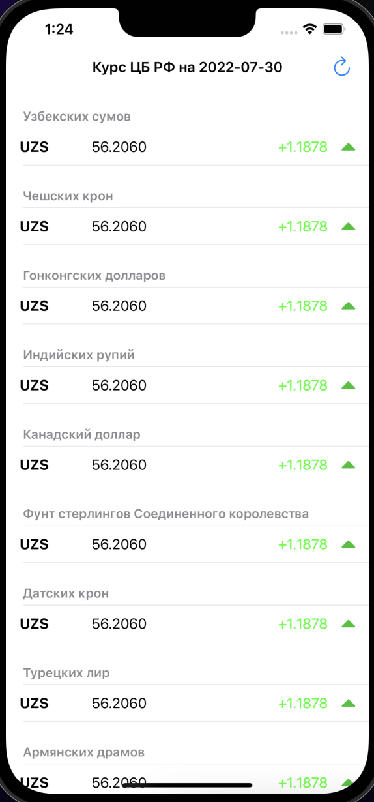

# MyExchangeRatesApp

## Краткое описание

Приложение по отражению курсов ЦБ РФ по состоянию на текущую дату.

При создании приложения использовался **UITableView** и использовался сетевой запрос данных с API https://www.cbr-xml-daily.ru/daily_json.js

## Внешний вид приложения

